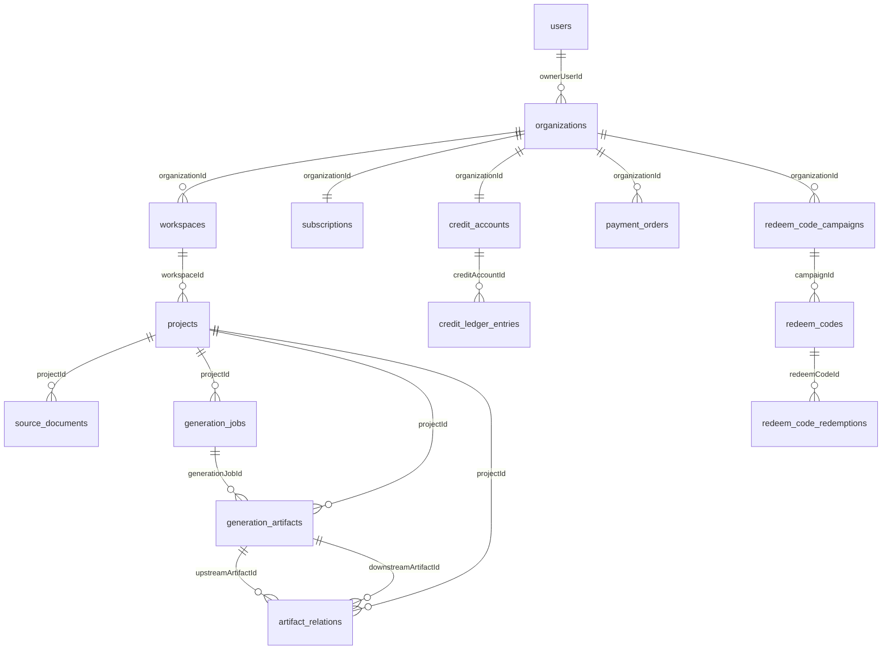

# NovelScript SaaS 数据库 Schema 文档

> 关联 PRD：`docs/comprehensive-prd.md` v3.0  
> 关联 FSD：`docs/functional-specification.md` v1.0  
> ORM：Drizzle ORM (PostgreSQL)  
> Schema 源码：`src/server/shared/platform/db/schema.ts`  
> 更新日期：2026-03-24  
> 版本：v1.0

---

## 1. Schema 总览



**共计 17 张表**，可分为 4 个域：

| 域 | 表 |
|---|---|
| 租户与身份 | `users`, `organizations`, `workspaces` |
| 创作链路 | `projects`, `source_documents`, `generation_jobs`, `generation_artifacts`, `artifact_relations` |
| 计费与积分 | `subscriptions`, `payment_orders`, `credit_accounts`, `credit_ledger_entries` |
| 兑换码 | `redeem_code_campaigns`, `redeem_codes`, `redeem_code_redemptions` |
| 基础设施 | `platform_store_snapshots` |

---

## 2. 通用约定

### 2.1 审计字段（auditColumns）

所有业务表均包含以下审计字段：

| 字段 | 类型 | 说明 |
|------|------|------|
| `createdAt` | `timestamp with time zone` NOT NULL | 创建时间 |
| `createdByUserId` | `text` | 创建者 ID |
| `updatedAt` | `timestamp with time zone` NOT NULL | 最后更新时间 |
| `updatedByUserId` | `text` | 最后更新者 ID |

### 2.2 data 列

每张表都有一个 `data` 列（`jsonb NOT NULL`），存储该实体的完整 JSON 快照。这使得查询时可以同时通过索引列快速定位、通过 data 列返回完整实体，无需 JOIN。

### 2.3 主键

所有表主键均为 `id: text`，使用应用层生成的 UUID/CUID。

---

## 3. 表定义

### 3.1 users

```sql
CREATE TABLE users (
  id            TEXT PRIMARY KEY,
  email         TEXT NOT NULL,
  displayName   TEXT NOT NULL,
  passwordHash  TEXT,
  avatarUrl     TEXT,
  preferredLocale TEXT,
  defaultOrganizationId TEXT,
  status        TEXT NOT NULL,      -- 'active' | 'invited' | 'suspended' | 'deleted'
  lastLoginAt   TIMESTAMP WITH TIME ZONE,
  createdAt     TIMESTAMP WITH TIME ZONE NOT NULL,
  createdByUserId TEXT,
  updatedAt     TIMESTAMP WITH TIME ZONE NOT NULL,
  updatedByUserId TEXT,
  data          JSONB NOT NULL
);
```

**索引**：

| 索引名 | 类型 | 列 |
|--------|------|-----|
| `users_email_idx` | UNIQUE | `email` |
| `users_default_organization_idx` | INDEX | `defaultOrganizationId` |

---

### 3.2 organizations

```sql
CREATE TABLE organizations (
  id              TEXT PRIMARY KEY,
  slug            TEXT NOT NULL,
  name            TEXT NOT NULL,
  ownerUserId     TEXT NOT NULL,
  status          TEXT NOT NULL,    -- 'active' | 'archived'
  billingLocale   TEXT NOT NULL,    -- 'zh-CN' | 'en-US'
  billingCurrency TEXT NOT NULL,    -- 'USD'
  pricingRegion   TEXT NOT NULL,    -- 'global'
  metadata        JSONB,
  -- audit columns + data
);
```

**索引**：

| 索引名 | 类型 | 列 |
|--------|------|-----|
| `organizations_slug_idx` | UNIQUE | `slug` |
| `organizations_owner_idx` | INDEX | `ownerUserId` |

---

### 3.3 workspaces

```sql
CREATE TABLE workspaces (
  id              TEXT PRIMARY KEY,
  organizationId  TEXT NOT NULL,
  slug            TEXT NOT NULL,
  name            TEXT NOT NULL,
  description     TEXT,
  status          TEXT NOT NULL,    -- 'active' | 'archived'
  defaultLocale   TEXT,
  defaultModelName TEXT,
  -- audit columns + data
);
```

**索引**：

| 索引名 | 类型 | 列 |
|--------|------|-----|
| `workspaces_org_slug_idx` | UNIQUE | `(organizationId, slug)` |
| `workspaces_org_idx` | INDEX | `organizationId` |

---

### 3.4 projects

```sql
CREATE TABLE projects (
  id                    TEXT PRIMARY KEY,
  organizationId        TEXT NOT NULL,
  workspaceId           TEXT NOT NULL,
  slug                  TEXT NOT NULL,
  name                  TEXT NOT NULL,
  description           TEXT,
  status                TEXT NOT NULL,    -- 'draft' | 'active' | 'archived'
  sourceDocumentId      TEXT,             -- FK → source_documents.id
  latestGenerationJobId TEXT,             -- FK → generation_jobs.id（快捷指针）
  genre                 TEXT,
  labels                JSONB,           -- string[]
  archivedAt            TIMESTAMP WITH TIME ZONE,
  -- audit columns + data
);
```

**索引**：

| 索引名 | 类型 | 列 |
|--------|------|-----|
| `projects_workspace_slug_idx` | UNIQUE | `(workspaceId, slug)` |
| `projects_organization_idx` | INDEX | `organizationId` |
| `projects_workspace_idx` | INDEX | `workspaceId` |
| `projects_source_document_idx` | INDEX | `sourceDocumentId` |

---

### 3.5 source_documents

```sql
CREATE TABLE source_documents (
  id              TEXT PRIMARY KEY,
  organizationId  TEXT NOT NULL,
  workspaceId     TEXT NOT NULL,
  projectId       TEXT NOT NULL,
  title           TEXT NOT NULL,
  kind            TEXT NOT NULL,    -- 'novel' | 'script' | 'outline' | 'storyboard' | 'reference' | 'export'
  status          TEXT NOT NULL,    -- 'draft' | 'ready' | 'archived'
  mimeType        TEXT NOT NULL,    -- 'text/plain'
  textContent     TEXT,             -- 原文正文（可能很大）
  storageKey      TEXT,             -- 外部存储 Key（未来用于文件上传）
  checksum        TEXT,
  wordCount       INTEGER,
  sourceVersion   TEXT,
  -- audit columns + data
);
```

**索引**：

| 索引名 | 类型 | 列 |
|--------|------|-----|
| `source_documents_project_idx` | INDEX | `projectId` |
| `source_documents_workspace_idx` | INDEX | `workspaceId` |

---

### 3.6 generation_jobs

```sql
CREATE TABLE generation_jobs (
  id                   TEXT PRIMARY KEY,
  organizationId       TEXT NOT NULL,
  workspaceId          TEXT NOT NULL,
  projectId            TEXT NOT NULL,
  sourceDocumentId     TEXT,
  kind                 TEXT NOT NULL,    -- 'script-generation' | 'storyboard-generation' | 'export-generation' | 'analysis-generation'
  status               TEXT NOT NULL,    -- 'queued' | 'running' | 'succeeded' | 'failed' | 'cancelled'
  billingState         TEXT NOT NULL,    -- 'none' | 'reserved' | 'captured' | 'released'
  reservedCredits      INTEGER,
  settledCredits       INTEGER,
  progress             INTEGER NOT NULL, -- 0-100
  currentStep          TEXT,
  requestedByUserId    TEXT,
  requestedBySessionId TEXT,
  modelName            TEXT,
  inputSnapshot        JSONB NOT NULL,   -- { payload, metadata }
  outputSummary        TEXT,
  errorMessage         TEXT,
  startedAt            TIMESTAMP WITH TIME ZONE,
  finishedAt           TIMESTAMP WITH TIME ZONE,
  cancelledAt          TIMESTAMP WITH TIME ZONE,
  -- audit columns + data
);
```

**索引**：

| 索引名 | 类型 | 列 |
|--------|------|-----|
| `generation_jobs_project_idx` | INDEX | `projectId` |
| `generation_jobs_workspace_idx` | INDEX | `workspaceId` |
| `generation_jobs_status_idx` | INDEX | `status` |

**inputSnapshot 结构**：
```json
{
  "payload": { /* ScriptGenerationRequest | StoryboardGenerateRequestV2 */ },
  "metadata": {
    "pipelineMode": "novel-to-storyboard",       // 可选
    "storyboardPayload": { /* 分镜配置 */ },      // 可选
    "upstreamJobId": "xxx"                        // 可选
  }
}
```

---

### 3.7 generation_artifacts

```sql
CREATE TABLE generation_artifacts (
  id                TEXT PRIMARY KEY,
  organizationId    TEXT NOT NULL,
  workspaceId       TEXT NOT NULL,
  projectId         TEXT NOT NULL,
  generationJobId   TEXT NOT NULL,
  sourceDocumentId  TEXT,
  kind              TEXT NOT NULL,    -- 'analysis' | 'outline' | 'script' | 'storyboard' | 'export' | 'prompt'
  format            TEXT NOT NULL,    -- MIME type
  title             TEXT NOT NULL,
  version           INTEGER NOT NULL,
  content           TEXT,             -- 工件正文
  storageKey        TEXT,
  checksum          TEXT,
  isEditable        BOOLEAN NOT NULL,
  parentArtifactId  TEXT,             -- 版本链上游
  versionGroupId    TEXT,             -- 版本组 ID
  metadata          JSONB,            -- 扩展元数据
  -- audit columns + data
);
```

**索引**：

| 索引名 | 类型 | 列 |
|--------|------|-----|
| `generation_artifacts_job_idx` | INDEX | `generationJobId` |
| `generation_artifacts_project_idx` | INDEX | `projectId` |
| `generation_artifacts_kind_version_idx` | INDEX | `(projectId, kind, version)` |
| `generation_artifacts_version_group_idx` | INDEX | `versionGroupId` |

**metadata 常见字段**：
```json
{
  "episode": 1,                                   // 剧本：集数
  "sourceScriptArtifactIds": ["artifact-id-1"],   // 分镜：来源剧本 ID
  "generationConfig": { /* 生成时的配置快照 */ }
}
```

**format 枚举值**：

| format | 说明 |
|--------|------|
| `text/plain` | 纯文本 |
| `application/json` | JSON 结构化数据 |
| `text/markdown` | Markdown |
| `application/pdf` | PDF |
| `application/zip` | ZIP 归档 |
| `application/vnd.openxmlformats-officedocument.wordprocessingml.document` | DOCX |

---

### 3.8 artifact_relations

```sql
CREATE TABLE artifact_relations (
  id                    TEXT PRIMARY KEY,
  projectId             TEXT NOT NULL,
  upstreamArtifactId    TEXT NOT NULL,    -- 来源工件
  downstreamArtifactId  TEXT NOT NULL,    -- 派生工件
  relationType          TEXT NOT NULL,    -- 'derived_from'
  metadata              JSONB,           -- { generationJobId, episode? }
  -- audit columns + data
);
```

**索引**：

| 索引名 | 类型 | 列 |
|--------|------|-----|
| `artifact_relations_project_idx` | INDEX | `projectId` |
| `artifact_relations_downstream_idx` | INDEX | `downstreamArtifactId` |

**关系链路示例**：
```
analysis ──derived_from──▶ outline
outline  ──derived_from──▶ script (第1集)
outline  ──derived_from──▶ script (第2集)
script   ──derived_from──▶ storyboard
```

---

### 3.9 subscriptions

```sql
CREATE TABLE subscriptions (
  id                       TEXT PRIMARY KEY,
  organizationId           TEXT NOT NULL,
  provider                 TEXT NOT NULL,    -- 'paypal' | 'internal'
  providerCustomerId       TEXT,
  providerSubscriptionId   TEXT,
  providerPriceId          TEXT,
  planKey                  TEXT NOT NULL,    -- 'free' | 'creator' | 'pro'
  status                   TEXT NOT NULL,    -- 'trialing' | 'active' | 'past_due' | 'canceled' | 'expired'
  billingInterval          TEXT NOT NULL,    -- 'monthly' | 'annual'
  currentPeriodStart       TIMESTAMP WITH TIME ZONE,
  currentPeriodEnd         TIMESTAMP WITH TIME ZONE,
  seatsIncluded            INTEGER,
  seatCount                INTEGER,
  entitlements             JSONB NOT NULL,   -- PlanEntitlements
  priceCents               INTEGER,
  currency                 TEXT,
  trialEndsAt              TIMESTAMP WITH TIME ZONE,
  canceledAt               TIMESTAMP WITH TIME ZONE,
  -- audit columns + data
);
```

**索引**：

| 索引名 | 类型 | 列 |
|--------|------|-----|
| `subscriptions_organization_idx` | UNIQUE | `organizationId` |
| `subscriptions_provider_subscription_idx` | INDEX | `providerSubscriptionId` |

**entitlements 结构**（`PlanEntitlements`）：
```json
{
  "maxProjects": 2,
  "maxWorkspaces": 1,
  "maxMembers": 1,
  "maxConcurrentJobs": 1,
  "monthlyCredits": 30,
  "canUseBranding": true,
  "canUseApiAccess": false,
  "canUsePrivateDeployment": false,
  "canUseTeamCollaboration": false
}
```

---

### 3.10 payment_orders

```sql
CREATE TABLE payment_orders (
  id                       TEXT PRIMARY KEY,
  organizationId           TEXT NOT NULL,
  subscriptionId           TEXT,
  provider                 TEXT NOT NULL,    -- 'paypal' | 'internal'
  purchaseKind             TEXT NOT NULL,    -- 'subscription' | 'credit-pack'
  status                   TEXT NOT NULL,    -- 'draft' | 'pending' | 'paid' | 'failed' | 'cancelled' | 'refunded'
  planKey                  TEXT,
  creditPackKey             TEXT,
  amountCents              INTEGER NOT NULL,
  currency                 TEXT NOT NULL,    -- 'USD'
  creditsGranted           INTEGER,
  providerOrderId          TEXT,
  providerCustomerId       TEXT,
  providerSubscriptionId   TEXT,
  paidAt                   TIMESTAMP WITH TIME ZONE,
  metadata                 JSONB,
  -- audit columns + data
);
```

**索引**：

| 索引名 | 类型 | 列 |
|--------|------|-----|
| `payment_orders_organization_idx` | INDEX | `organizationId` |
| `payment_orders_provider_order_idx` | UNIQUE | `providerOrderId` |

---

### 3.11 credit_accounts

```sql
CREATE TABLE credit_accounts (
  id                    TEXT PRIMARY KEY,
  organizationId        TEXT NOT NULL,
  availableCredits      INTEGER NOT NULL,  -- 可用积分
  reservedCredits       INTEGER NOT NULL,  -- 已预留积分
  grantedCreditsTotal   INTEGER NOT NULL,  -- 历史总发放
  consumedCreditsTotal  INTEGER NOT NULL,  -- 历史总消耗
  -- audit columns + data
);
```

**索引**：

| 索引名 | 类型 | 列 |
|--------|------|-----|
| `credit_accounts_organization_idx` | UNIQUE | `organizationId` |

**余额公式**：`availableCredits = grantedCreditsTotal - consumedCreditsTotal - reservedCredits`

---

### 3.12 credit_ledger_entries

```sql
CREATE TABLE credit_ledger_entries (
  id                TEXT PRIMARY KEY,
  organizationId    TEXT NOT NULL,
  creditAccountId   TEXT NOT NULL,
  kind              TEXT NOT NULL,    -- ledger entry 类型
  deltaCredits      INTEGER NOT NULL, -- 正=增加, 负=减少
  balanceAfter      INTEGER NOT NULL, -- 操作后余额
  paymentOrderId    TEXT,
  generationJobId   TEXT,
  redeemCodeId      TEXT,
  note              TEXT,
  metadata          JSONB,
  -- audit columns + data
);
```

**kind 枚举**：

| kind | 说明 | deltaCredits |
|------|------|-------------|
| `subscription_grant` | 订阅月度发放 | +N |
| `pack_purchase` | 点数包购买 | +N |
| `redeem_code_grant` | 兑换码发放 | +N |
| `manual_adjustment` | 人工调整 | ±N |
| `job_reserve` | 任务预留 | -N |
| `job_capture` | 任务扣减确认 | 0 (已预留) |
| `job_release` | 任务退还 | +N |
| `refund_adjustment` | 退款调整 | +N |

**索引**：

| 索引名 | 类型 | 列 |
|--------|------|-----|
| `credit_ledger_entries_organization_idx` | INDEX | `organizationId` |
| `credit_ledger_entries_generation_job_idx` | INDEX | `generationJobId` |

---

### 3.13 usage_events

```sql
CREATE TABLE usage_events (
  id              TEXT PRIMARY KEY,
  organizationId  TEXT NOT NULL,
  workspaceId     TEXT,
  projectId       TEXT,
  generationJobId TEXT,
  userId          TEXT,
  kind            TEXT NOT NULL,    -- 'llm_request' | 'generation_job' | 'export' | 'storage' | 'api_request' | 'billing' | 'credit'
  featureKey      TEXT NOT NULL,
  modelName       TEXT,
  inputTokens     INTEGER,
  outputTokens    INTEGER,
  costCents       INTEGER,
  quantity         INTEGER,
  occurredAt      TIMESTAMP WITH TIME ZONE NOT NULL,
  metadata        JSONB,
  -- audit columns + data
);
```

**索引**：

| 索引名 | 类型 | 列 |
|--------|------|-----|
| `usage_events_organization_idx` | INDEX | `organizationId` |
| `usage_events_workspace_idx` | INDEX | `workspaceId` |
| `usage_events_occurred_idx` | INDEX | `occurredAt` |

---

### 3.14 redeem_code_campaigns

```sql
CREATE TABLE redeem_code_campaigns (
  id                    TEXT PRIMARY KEY,
  organizationId        TEXT,
  name                  TEXT NOT NULL,
  description           TEXT,
  status                TEXT NOT NULL,    -- 'draft' | 'active' | 'expired' | 'archived'
  creditsGranted        INTEGER NOT NULL,
  codePrefix            TEXT,
  totalLimit            INTEGER,
  perOrganizationLimit  INTEGER,
  startsAt              TIMESTAMP WITH TIME ZONE,
  endsAt                TIMESTAMP WITH TIME ZONE,
  eligiblePlanKeys      JSONB,           -- string[]
  metadata              JSONB,
  -- audit columns + data
);
```

### 3.15 redeem_codes

```sql
CREATE TABLE redeem_codes (
  id              TEXT PRIMARY KEY,
  campaignId      TEXT NOT NULL,
  code            TEXT NOT NULL,
  status          TEXT NOT NULL,    -- 'active' | 'disabled' | 'expired' | 'archived'
  creditsGranted  INTEGER NOT NULL,
  maxRedemptions  INTEGER NOT NULL,
  redeemedCount   INTEGER NOT NULL,
  expiresAt       TIMESTAMP WITH TIME ZONE,
  metadata        JSONB,
  -- audit columns + data
);
```

**索引**：`redeem_codes_code_idx` (UNIQUE on `code`), `redeem_codes_campaign_idx` (on `campaignId`)

### 3.16 redeem_code_redemptions

```sql
CREATE TABLE redeem_code_redemptions (
  id                  TEXT PRIMARY KEY,
  redeemCodeId        TEXT NOT NULL,
  campaignId          TEXT NOT NULL,
  organizationId      TEXT NOT NULL,
  userId              TEXT NOT NULL,
  creditLedgerEntryId TEXT NOT NULL,
  redeemedAt          TIMESTAMP WITH TIME ZONE NOT NULL,
  -- audit columns + data
);
```

**索引**：`redeem_code_redemptions_organization_idx`, `redeem_code_redemptions_code_idx`

### 3.17 platform_store_snapshots

```sql
CREATE TABLE platform_store_snapshots (
  key        TEXT PRIMARY KEY,
  version    INTEGER NOT NULL,
  payload    JSONB NOT NULL,
  updatedAt  TIMESTAMP WITH TIME ZONE NOT NULL
);
```

基础设施表，用于持久化存储运行时快照数据。

---

## 4. 数据完整性约束

### 4.1 业务级唯一性约束

| 约束 | 说明 |
|------|------|
| `users.email` UNIQUE | 邮箱全局唯一 |
| `organizations.slug` UNIQUE | 组织 slug 全局唯一 |
| `(workspaces.organizationId, workspaces.slug)` UNIQUE | 同一 org 下 workspace slug 唯一 |
| `(projects.workspaceId, projects.slug)` UNIQUE | 同一 workspace 下 project slug 唯一 |
| `subscriptions.organizationId` UNIQUE | 每个 org 只有一个当前订阅 |
| `credit_accounts.organizationId` UNIQUE | 每个 org 只有一个积分账户 |
| `payment_orders.providerOrderId` UNIQUE | 防止重复支付处理 |
| `redeem_codes.code` UNIQUE | 兑换码全局唯一 |

### 4.2 应用层约束（非数据库外键）

本项目未使用数据库级外键约束，依赖应用层保证数据一致性：

| 关系 | 说明 |
|------|------|
| `organizations.ownerUserId → users.id` | 应用层校验 |
| `workspaces.organizationId → organizations.id` | 应用层校验 |
| `projects.workspaceId → workspaces.id` | 应用层校验 |
| `generation_jobs.projectId → projects.id` | 应用层校验 |
| `generation_artifacts.generationJobId → generation_jobs.id` | 应用层校验 |
| `artifact_relations.upstreamArtifactId → generation_artifacts.id` | 应用层校验 |
| `artifact_relations.downstreamArtifactId → generation_artifacts.id` | 应用层校验 |

---

## 5. 枚举值速查表

| 字段 | 允许值 |
|------|-------|
| `UserStatus` | `active`, `invited`, `suspended`, `deleted` |
| `OrganizationStatus` | `active`, `archived` |
| `WorkspaceStatus` | `active`, `archived` |
| `ProjectStatus` | `draft`, `active`, `archived` |
| `SourceDocumentKind` | `novel`, `script`, `outline`, `storyboard`, `reference`, `export` |
| `SourceDocumentStatus` | `draft`, `ready`, `archived` |
| `GenerationJobKind` | `script-generation`, `storyboard-generation`, `export-generation`, `analysis-generation` |
| `GenerationJobStatus` | `queued`, `running`, `succeeded`, `failed`, `cancelled` |
| `GenerationJobBillingState` | `none`, `reserved`, `captured`, `released` |
| `GenerationArtifactKind` | `analysis`, `outline`, `script`, `storyboard`, `export`, `prompt` |
| `ArtifactRelationType` | `derived_from` |
| `SubscriptionStatus` | `trialing`, `active`, `past_due`, `canceled`, `expired` |
| `SubscriptionProvider` | `paypal`, `internal` |
| `BillingProvider` | `paypal`, `internal` |
| `PurchaseKind` | `subscription`, `credit-pack` |
| `PaymentOrderStatus` | `draft`, `pending`, `paid`, `failed`, `cancelled`, `refunded` |
| `CreditLedgerEntryKind` | `subscription_grant`, `pack_purchase`, `redeem_code_grant`, `manual_adjustment`, `job_reserve`, `job_capture`, `job_release`, `refund_adjustment` |
| `SupportedLocale` | `zh-CN`, `en-US` |
| `SupportedCurrency` | `USD` |
| `PricingRegion` | `global` |
| `BillingInterval` | `monthly`, `annual` |
