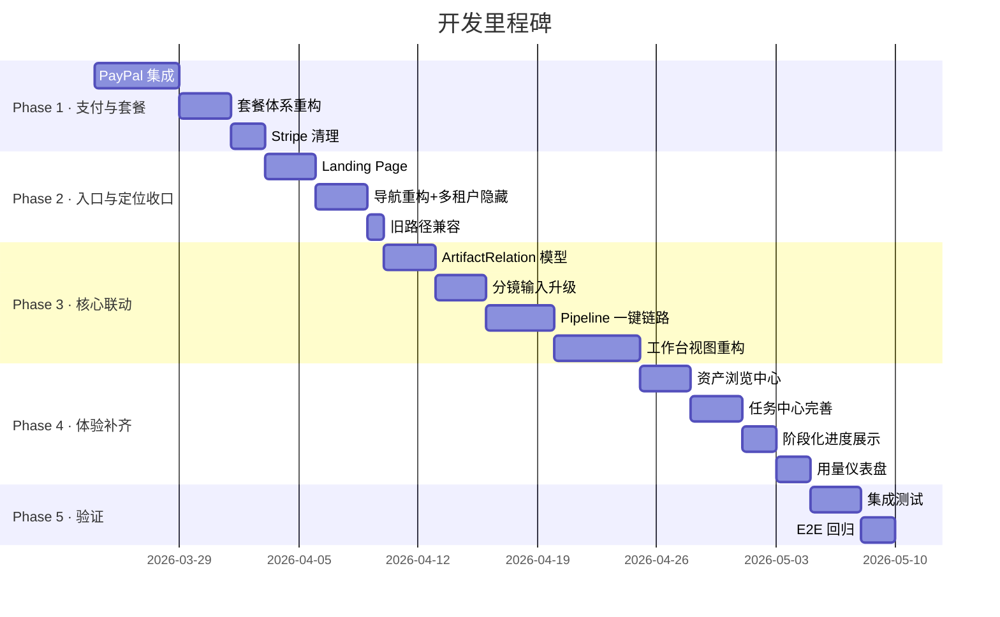

# NovelScript SaaS 平台开发计划

> 更新日期：2026-03-24 v3.0  
> 关联 PRD：`docs/comprehensive-prd.md` v3.0  
> 关联 FSD：`docs/functional-specification.md` v1.0  
> 关联 Schema：`docs/database-schema.md` v1.0  
> 关联 API Spec：`docs/api-specification.md` v1.0

---

## 1. 开发阶段概览



**总工期预估：~47 工作日（约 9-10 周）**

---

## 2. Phase 1：支付系统与套餐（10 天）

### 2.1 PayPal 集成（5 天）

| 步骤 | 涉及文件 | 任务 |
|------|---------|------|
| SDK 搭建 | `[NEW] src/server/billing/paypal.ts` | PayPal Client 工厂函数、`isPayPalEnabled()` |
| 订阅 | `[NEW] src/app/api/billing/paypal/create-subscription/route.ts` | PayPal Subscription Plans → `BILLING.SUBSCRIPTION.ACTIVATED` |
| 一次性支付 | `[NEW] src/app/api/billing/paypal/create-order/route.ts`<br>`[NEW] src/app/api/billing/paypal/capture-order/route.ts` | 点数包一次性支付 |
| Webhook | `[NEW] src/app/api/billing/paypal/webhook/route.ts` | Webhook 签名验证 + 权益交付 |
| 前端 | `[MODIFY] src/features/saas/PricingClient.tsx` | PayPal Buttons 替代 Stripe Checkout |

### 2.2 套餐体系重构（3 天）

**文件：** `[MODIFY] src/server/billing/catalog.ts`

| 变更 | 说明 |
|------|------|
| `PlanKey` | `'trial'\|'pro'\|'studio'` → `'free'\|'creator'\|'pro'` |
| 移除 Studio | 删除含 `maxMembers: 10` 和 `canUseTeamCollaboration: true` 的计划 |
| 移除 CNY | 所有 `prices` 只保留 USD |
| 调整额度 | Free: 30 credits / Creator: 200 / Pro: 600 |
| Credit packs | 50/200/500 三档，USD only |

### 2.3 Stripe 清除（2 天）

| 操作 | 文件 |
|------|------|
| 删除 | `src/server/billing/stripe.ts` |
| 删除 | `src/app/api/stripe/` 整个目录 |
| 修改 | `src/server/billing/payments.ts` — 移除 Stripe imports/functions |
| 修改 | `src/server/shared/platform/domain/entities.ts` — `BillingProvider` 改为 `'paypal'\|'internal'` |
| 修改 | `package.json` — `npm uninstall stripe` |
| 验证 | `npm run build && npm run typecheck` 无错误，grep `stripe` 无残留 |

---

## 3. Phase 2：入口与定位收口（7 天）

### 3.1 Landing Page（3 天）

| 文件 | 变更 |
|------|------|
| `[MODIFY] src/app/page.tsx` | 检测登录态：已登录 → redirect `/{locale}/projects`；未登录 → Landing |
| `[NEW] src/features/landing/LandingPage.tsx` | Hero + 功能展示 + 套餐预览 + CTA |
| `[MODIFY] src/app/[locale]/page.tsx` | CTA 指向 `/projects` 而非 `/console` |

### 3.2 导航重构 + 多租户隐藏（3 天）

| 文件 | 变更 |
|------|------|
| `[MODIFY] src/app/nav-links.tsx` | 移除"📖 小说转剧本 / 🎥 分镜提示词"；改为 Projects / Pricing |
| `[MODIFY] src/components/AppShellHeader.tsx` | 已登录：Credits 显示 + 用户头像；未登录：Login/Sign Up |
| `[MODIFY] src/components/MobileNav.tsx` | 同步更新移动端导航 |
| 多处 UI | 确保前端不出现"工作区"、"组织"字样 |

> [!IMPORTANT]
> **多租户隐藏原则**：后端保留 `Organization/Workspace` 数据模型，但前端 UI 中所有对用户可见的文本、标题、导航均不出现这些概念。用户注册时自动创建 org+workspace，全程无感知。

### 3.3 旧路径兼容（1 天）

| 旧路径 | 行为 |
|--------|------|
| `/console` | redirect → `/{locale}/projects` |
| `/storyboard` | redirect → `/{locale}/projects`（已登录）/ Landing（未登录） |
| `/` (root) | 已登录 redirect / 未登录 Landing |

---

## 4. Phase 3：核心功能联动（15 天）

### 4.1 ArtifactRelation 模型（3 天）

| 文件 | 变更 |
|------|------|
| `[MODIFY] src/server/shared/platform/domain/entities.ts` | 新增 `ArtifactRelation` 类型 |
| `[MODIFY] src/server/shared/platform/db/schema.ts` | 新增 `artifact_relations` 表 |
| `[MODIFY] src/server/shared/platform/repositories/index.ts` | 新增 repo：`create`, `createMany`, `listByProjectId`, `listByDownstreamArtifactId` |
| `[MODIFY] src/server/shared/platform/runtime/persistent-runtime.ts` | 注册仓储 |
| `[MODIFY] src/server/projects/service.ts` | `getProjectBundle` 返回 `artifactRelations` |

### 4.2 分镜输入升级（3 天）

| 文件 | 变更 |
|------|------|
| `[MODIFY] src/features/storyboard/contracts.ts` | 新增 `StoryboardGenerateRequestV2`，以 `scriptArtifactIds` 为输入 |
| `[MODIFY] src/server/storyboard/application/run-storyboard-generation.ts` | 根据 artifact ID 读取剧本内容 |
| `[MODIFY] src/app/api/projects/[projectId]/jobs/route.ts` | 强类型判别联合请求 |
| 后处理 | 分镜完成后写入 `ArtifactRelation` + metadata `sourceScriptArtifactIds` |

### 4.3 Pipeline 一键链路（4 天）

| 文件 | 变更 |
|------|------|
| `[NEW] src/app/api/projects/[projectId]/pipelines/route.ts` | Pipeline API 路由 |
| `[NEW] src/server/generation/pipeline-service.ts` | 编排逻辑：创建剧本 Job → 成功后创建分镜 Job |
| `[MODIFY] src/server/generation/processor.ts` | 支持 pipeline 回调 |

**关键逻辑：**
1. 创建剧本 Job，在 metadata 标记 `pipelineMode: 'novel-to-storyboard'`
2. 剧本 Job 成功 → 提取 script 工件 ID → 自动创建分镜 Job
3. 剧本 Job 失败 → pipeline 终止，保留已有工件
4. 用户可中途在剧本阶段手动调整后，再手动继续生成分镜

### 4.4 工作台视图重构（5 天）

| 文件 | 变更 |
|------|------|
| `[MODIFY] src/features/saas/ProjectWorkspaceClient.tsx` | Tab 重构：原文 / 分析 / 大纲 / 剧本 / 分镜 / 导出 / 任务 |
| `[MODIFY] src/features/saas/project/SourceEditorPanel.tsx` | 保留生成剧本；新增「一键生成分镜」按钮；移除原有分镜按钮 |
| `[MODIFY] src/features/saas/project/ProjectArtifactStudioPanel.tsx` | 剧本 Tab 新增「从此版本生成分镜」入口 |
| `[NEW] src/features/saas/project/StoryboardPanel.tsx` | 分镜 Tab：浏览/下载分镜 + 依赖来源展示 |
| 每个 Tab | 显示工件内容 + 版本列表 + 操作按钮 + 依赖来源 |

**联动入口逻辑：**

```
原文 Tab：
  → [生成剧本]
  → [一键生成分镜]（说明：先生成剧本再自动生成分镜）

剧本 Tab（有工件时）：
  → [从此版本生成分镜]
  → [下载] [编辑/保存版本]

分镜 Tab：
  → 浏览分镜内容
  → 来源：剧本 v3（可点击跳转）
  → [下载]
```

---

## 5. Phase 4：体验补齐（10 天）

### 5.1 资产浏览中心（3 天）

| 文件 | 变更 |
|------|------|
| `[NEW] src/features/saas/project/AssetBrowserPanel.tsx` | 统一资产浏览组件 |
| `[MODIFY] src/app/globals.css` | 资产卡片、依赖关系图样式 |

**功能：**
- 按类型筛选：全部 / 分析 / 大纲 / 剧本 / 分镜
- 按时间排序
- 依赖关系可视化：`分析 → 大纲 → 剧本 → 分镜`
- 批量下载入口

### 5.2 任务中心完善（3 天）

| 文件 | 变更 |
|------|------|
| `[MODIFY] src/features/saas/project/JobTimelinePanel.tsx` | 增强状态展示和操作 |

**功能：**
- 完整状态展示：排队中 / 运行中 / 成功 / 失败 / 已取消
- 失败时显示失败阶段和错误原因
- 重试按钮（从失败任务直接重试）
- Pipeline 模式下两阶段独立进度

### 5.3 阶段化进度展示（2 天）

| 文件 | 变更 |
|------|------|
| `[NEW] src/features/saas/project/PipelineProgressBar.tsx` | 流程进度条组件 |
| `[MODIFY] src/features/saas/ProjectWorkspaceClient.tsx` | 集成进度条 |

**功能：**
- 展示当前执行阶段：`预处理 → 分析 → 大纲 → 剧本 → 分镜`
- 已完成阶段 ✅ / 进行中阶段 🔄 / 等待中阶段 ⏳
- 一键模式和单步模式都复用此组件

### 5.4 用量仪表盘（2 天）

| 文件 | 变更 |
|------|------|
| `[MODIFY] src/features/saas/BillingClient.tsx` | 增加用量可视化 |
| `[MODIFY] src/components/AppShellHeader.tsx` | 顶栏 Credits 余额显示 |

---

## 6. Phase 5：测试与验证（5 天）

### 6.1 自动化测试（3 天）

**测试框架：** Vitest（已有）

| 测试域 | 类型 | 覆盖 |
|--------|------|------|
| `billing/catalog` | Unit | 新 catalog Free/Creator/Pro、无 CNY、无 Team |
| `billing/payments` | Unit | PayPal order 创建、webhook mock |
| `generation/pipeline-service` | Unit | 串行编排、失败中止、工件保留 |
| `ArtifactRelation` repo | Unit | 创建、查询、批量写入 |
| API routes | Integration | jobs（强类型）、pipelines、project bundle（含 relations） |

```bash
npm run test
npm run typecheck
```

### 6.2 E2E 验证清单（2 天）

| # | 场景 | 预期 |
|---|------|------|
| 1 | 未登录访问首页 | Landing Page，非匿名工具台 |
| 2 | 注册新用户 | 自动 org+workspace，用户无感知，Free plan + 30 credits |
| 3 | UI 中无"工作区""组织"字样 | 全站检查 |
| 4 | 创建项目 → 生成剧本 | 项目内 analysis/outline/script 工件 |
| 5 | 剧本 Tab → 继续生成分镜 | 分镜绑定剧本版本，metadata 有来源 |
| 6 | 一键小说→分镜 | 前端展示阶段进度，中间工件保留 |
| 7 | 一键模式中途剧本失败 | 分镜不启动，已有工件保留 |
| 8 | 资产浏览器 | 按类型筛选、依赖关系展示 |
| 9 | PayPal 订阅 (sandbox) | 权益正确交付 |
| 10 | PayPal 点数包 (sandbox) | credits 即时到账 |
| 11 | 额度不足时生成 | 提示 INSUFFICIENT_CREDITS |
| 12 | 旧路径 /console 访问 | 正确重定向 |
| 13 | 历史工件（无 relation） | 降级展示，不报错 |
| 14 | 工件下载 | TXT/MD/JSON 正常 |

---

## 7. 文件变更汇总

### 新增文件（15）

| 文件 | 用途 |
|------|------|
| `src/server/billing/paypal.ts` | PayPal SDK |
| `src/app/api/billing/paypal/create-subscription/route.ts` | 订阅创建 |
| `src/app/api/billing/paypal/create-order/route.ts` | 订单创建 |
| `src/app/api/billing/paypal/capture-order/route.ts` | 支付捕获 |
| `src/app/api/billing/paypal/webhook/route.ts` | Webhook |
| `src/app/api/projects/[projectId]/pipelines/route.ts` | Pipeline API |
| `src/server/generation/pipeline-service.ts` | Pipeline 编排 |
| `src/features/landing/LandingPage.tsx` | Landing Page |
| `src/features/saas/project/StoryboardPanel.tsx` | 分镜面板 |
| `src/features/saas/project/AssetBrowserPanel.tsx` | 资产浏览器 |
| `src/features/saas/project/PipelineProgressBar.tsx` | 阶段进度条 |
| `.env.local.example` | 环境变量模板 |

### 修改文件（20+）

| 文件 | 域 |
|------|-----|
| `package.json` | 依赖 |
| `src/server/billing/catalog.ts` | 套餐 |
| `src/server/billing/payments.ts` | 支付 |
| `src/server/shared/platform/domain/entities.ts` | 领域模型 |
| `src/server/shared/platform/db/schema.ts` | 数据库 |
| `src/server/shared/platform/repositories/index.ts` | 仓储 |
| `src/server/shared/platform/runtime/persistent-runtime.ts` | 运行时 |
| `src/server/projects/service.ts` | 项目 bundle |
| `src/features/storyboard/contracts.ts` | V2 合同 |
| `src/server/storyboard/application/run-storyboard-generation.ts` | 分镜服务 |
| `src/app/api/projects/[projectId]/jobs/route.ts` | Job API |
| `src/app/page.tsx` | 首页 |
| `src/app/[locale]/page.tsx` | Landing CTA |
| `src/app/nav-links.tsx` | 导航 |
| `src/components/AppShellHeader.tsx` | 顶栏 |
| `src/components/MobileNav.tsx` | 移动端导航 |
| `src/features/saas/ProjectWorkspaceClient.tsx` | 工作台 |
| `src/features/saas/project/SourceEditorPanel.tsx` | 原文面板 |
| `src/features/saas/project/ProjectArtifactStudioPanel.tsx` | 工件面板 |
| `src/features/saas/project/JobTimelinePanel.tsx` | 任务面板 |
| `src/features/saas/PricingClient.tsx` | 定价UI |
| `src/features/saas/BillingClient.tsx` | 计费UI |
| `src/app/globals.css` | 样式 |

### 删除文件（2+）

| 文件 | 原因 |
|------|------|
| `src/server/billing/stripe.ts` | Stripe 移除 |
| `src/app/api/stripe/` | Stripe webhook |

---

## 8. 每日里程碑

| 工作日 | 目标 | 关键交付物 |
|--------|------|-----------|
| D1-D2 | PayPal SDK + 订阅流程 | `paypal.ts`, subscription API |
| D3-D4 | 点数包支付 + 前端 PayPal 按钮 | order API, PricingClient |
| D5 | Webhook + 沙盒端到端测试 | webhook route |
| D6-D8 | 套餐重构 + Stripe 清理 | catalog.ts, stripe 代码移除 |
| D9-D10 | build 验证 + 支付回归 | 零 Stripe 残留 |
| D11-D13 | Landing Page | LandingPage.tsx |
| D14-D16 | 导航重构 + 多租户隐藏验证 | nav-links.tsx, UI 文案检查 |
| D17 | 旧路径兼容 | redirect 逻辑 |
| D18-D20 | ArtifactRelation 模型 | entities, schema, repo |
| D21-D23 | 分镜输入升级 | contracts V2, job route |
| D24-D27 | Pipeline 一键链路 | pipeline API + service |
| D28-D32 | 工作台视图重构 | 7-Tab 工作台 |
| D33-D35 | 资产浏览中心 | AssetBrowserPanel |
| D36-D38 | 任务中心完善 | JobTimelinePanel 增强 |
| D39-D40 | 阶段化进度 + 用量仪表盘 | PipelineProgressBar |
| D41-D43 | 自动化测试 | test files |
| D44-D47 | E2E 验证 + bug 修复 | 发布就绪 |

---

## 9. 实施任务清单

> 每项任务可独立勾选。完成标准参见 FSD 对应模块和 PRD 验收标准。

### Phase 1：支付系统与套餐（10 天）

#### 1.1 PayPal SDK 搭建
- [x] 创建 `src/server/billing/paypal.ts` — PayPal Client 工厂函数
- [x] 实现 `isPayPalEnabled()` 环境检测
- [x] 添加环境变量：`PAYPAL_CLIENT_ID`, `PAYPAL_CLIENT_SECRET`, `PAYPAL_MODE`, `PAYPAL_WEBHOOK_ID`
- [x] 更新 `.env.local.example`

#### 1.2 PayPal 订阅
- [x] 创建 `src/app/api/billing/paypal/create-subscription/route.ts`
- [x] 实现 PayPal Subscription Plans 创建逻辑
- [x] 处理 `BILLING.SUBSCRIPTION.ACTIVATED` webhook 事件
- [x] 订阅激活后 → `upsertCurrent` Subscription + 发放月度 credits

#### 1.3 PayPal 一次性支付（点数包）
- [x] 创建 `src/app/api/billing/paypal/create-order/route.ts`
- [x] 创建 `src/app/api/billing/paypal/capture-order/route.ts`
- [x] 支付捕获后 → 创建 PaymentOrder + 发放 credits

#### 1.4 PayPal Webhook
- [x] 创建 `src/app/api/billing/paypal/webhook/route.ts`
- [x] 实现 webhook 签名验证
- [x] 幂等处理：通过 `providerOrderId` 防止重复交付
- [x] 处理事件：`BILLING.SUBSCRIPTION.ACTIVATED`, `CANCELLED`, `EXPIRED`, `PAYMENT.CAPTURE.COMPLETED`

#### 1.5 前端 PayPal 集成
- [x] 修改 `src/features/saas/PricingClient.tsx` — PayPal Buttons 替代旧按钮
- [x] 订阅流程前端：创建订阅 → PayPal 弹窗 → 回调确认
- [x] 点数包流程前端：创建订单 → PayPal 弹窗 → 捕获订单

#### 1.6 套餐体系重构
- [x] 修改 `src/server/billing/catalog.ts` — `PlanKey` 改为 `'free' | 'creator' | 'pro'`
- [x] 验证 Free: 30 credits / Creator: 200 / Pro: 600
- [x] 验证所有计划 `maxMembers: 1`, `canUseTeamCollaboration: false`
- [x] 验证所有 `prices` 只保留 USD
- [x] 验证 Credit packs: 50/200/500 三档

#### 1.7 Stripe 完全清除
- [x] 删除 `src/server/billing/stripe.ts`
- [x] 删除 `src/app/api/stripe/` 整个目录
- [x] 修改 `src/server/billing/payments.ts` — 移除 Stripe imports/functions
- [x] 修改 `src/server/shared/platform/domain/entities.ts` — `BillingProvider` 只保留 `'paypal' | 'internal'`
- [x] 运行 `npm uninstall stripe`
- [x] 运行 `npm run build && npm run typecheck` 验证无错误
- [x] `grep -r "stripe" src/` 确认无残留

---

### Phase 2：入口与定位收口（7 天）

#### 2.1 Landing Page
- [x] 修改 `src/app/page.tsx` — 登录态检测：已登录 → redirect `/{locale}/projects`
- [x] 创建 `src/features/landing/LandingPage.tsx` — Hero + 功能展示 + 套餐预览 + CTA
- [x] 修改 `src/app/[locale]/page.tsx` — CTA 指向 `/projects` 而非 `/console`
- [x] Landing Page 适配移动端响应式

#### 2.2 导航重构
- [x] 修改 `src/app/nav-links.tsx` — 移除工具页入口，改为 Projects / Pricing
- [x] 修改 `src/components/AppShellHeader.tsx` — 已登录显示 Credits + 头像；未登录显示 Login/Sign Up
- [x] 修改 `src/components/MobileNav.tsx` — 同步移动端导航

#### 2.3 多租户隐藏
- [x] 全站 UI 文案检查：确保无「工作区」「组织」「团队」字样
- [x] 注册流程自动创建 org + workspace，用户无感知
- [x] 确认 `src/server/shared/platform/domain/entities.ts` 保留 Organization/Workspace 模型

#### 2.4 旧路径兼容
- [x] `/console` → redirect `/{locale}/projects`
- [x] `/storyboard` → 已登录 redirect / 未登录 Landing
- [x] `/` (root) → 已登录 redirect / 未登录 Landing

---

### Phase 3：核心功能联动（15 天）

#### 3.1 ArtifactRelation 模型
- [x] 确认 `entities.ts` 中 `ArtifactRelation` 类型已定义（✅ 已有）
- [x] 确认 `schema.ts` 中 `artifact_relations` 表已定义（✅ 已有）
- [x] 确认 `repositories/index.ts` 中 `ArtifactRelationRepository` 已定义（✅ 已有）
- [x] 确认 `persistent-runtime.ts` 中仓储已注册
- [x] 确认 `getProjectBundle()` 返回 `artifactRelations`（✅ 已有）

#### 3.2 分镜输入升级
- [x] 确认 `contracts.ts` 中 `StoryboardGenerateRequestV2` 已定义（✅ 已有 `scriptArtifactIds`）
- [x] 确认 `jobs/route.ts` 中 `normalizeStoryboardPayload()` 已实现（✅ 已有）
- [x] 确认分镜完成后写入 ArtifactRelation（✅ 已在 `processor.ts` 实现）
- [x] 确认分镜 artifact metadata 记录 `sourceScriptArtifactIds`

#### 3.3 Pipeline 一键链路
- [x] 确认 `src/app/api/projects/[projectId]/pipelines/route.ts` 已创建（✅ 已有）
- [x] 确认 `src/server/generation/pipeline-service.ts` 已实现（✅ 已有）
- [x] 确认 `processor.ts` 中 `maybeRunNovelToStoryboardPipeline()` 已实现（✅ 已有）
- [x] 验证：剧本失败 → pipeline 终止，已有工件保留
- [x] 验证：用户可中途取消 → 分镜 Job 不创建

#### 3.4 工作台视图重构
- [x] 修改 `src/features/saas/ProjectWorkspaceClient.tsx` — 7 Tab 重构
- [x] Tab 1 - 原文：粘贴/编辑/保存，「生成剧本」+「一键生成分镜」按钮
- [x] Tab 2 - 分析：浏览 analysis 工件 + 下载
- [x] Tab 3 - 大纲：浏览 outline 工件 + 下载
- [x] Tab 4 - 剧本：按集查看/下载 + 「从此版本生成分镜」入口
- [x] Tab 5 - 分镜：浏览/下载 + 依赖来源展示
- [x] Tab 6 - 导出：统一筛选/下载
- [x] Tab 7 - 任务：状态/进度/重试
- [x] 修改 `src/features/saas/project/SourceEditorPanel.tsx` — 新增「一键生成分镜」按钮
- [x] 修改 `src/features/saas/project/ProjectArtifactStudioPanel.tsx` — 剧本 Tab 新增分镜入口
- [x] 创建 `src/features/saas/project/StoryboardPanel.tsx` — 分镜 Tab

---

### Phase 4：体验补齐（10 天）

#### 4.1 资产浏览中心
- [x] 创建 `src/features/saas/project/AssetBrowserPanel.tsx`
- [x] 按类型筛选：全部 / 分析 / 大纲 / 剧本 / 分镜
- [x] 按时间排序
- [x] 依赖关系可视化展示
- [x] 历史工件无 relation 时降级展示
- [x] 批量下载入口

#### 4.2 任务中心完善
- [x] 修改 `src/features/saas/project/JobTimelinePanel.tsx`
- [x] 完整状态展示：排队中 / 运行中 / 成功 / 失败 / 已取消
- [x] 失败时显示失败阶段和错误原因
- [x] 重试按钮（从失败任务直接重试）
- [x] Pipeline 模式下两阶段独立进度

#### 4.3 阶段化进度展示
- [x] 创建 `src/features/saas/project/PipelineProgressBar.tsx`
- [x] 展示阶段：预处理 → 分析 → 大纲 → 剧本 → 分镜
- [x] 已完成 ✅ / 进行中 🔄 / 等待中 ⏳
- [x] 集成到 `ProjectWorkspaceClient.tsx`
- [x] 一键模式和单步模式复用

#### 4.4 用量仪表盘
- [x] 修改 `src/features/saas/BillingClient.tsx` — 增加用量可视化
- [x] 修改 `src/components/AppShellHeader.tsx` — 顶栏 Credits 余额显示
- [x] 展示：当前余额、本月消耗、消耗来源分布

---

### Phase 5：测试与验证（5 天）

#### 5.1 单元测试
- [x] `billing/catalog` — 新 catalog Free/Creator/Pro、无 CNY、无 Team
- [x] `billing/payments` — PayPal order 创建、webhook mock
- [x] `generation/pipeline-service` — 串行编排、失败中止、工件保留
- [x] `ArtifactRelation` repo — 创建、查询、批量写入

#### 5.2 集成测试
- [x] API routes: jobs（强类型）
- [x] API routes: pipelines
- [x] API routes: project bundle（含 relations）
- [x] 运行 `npm run test` 通过
- [x] 运行 `npm run typecheck` 通过

#### 5.3 E2E 验证清单

注：截至 2026-03-24，本地自动化、route-to-route 集成和离线 smoke 已完成；下面两项 PayPal sandbox 验收仍待真实外部 Sandbox 联调，并应在 [docs/paypal-sandbox-execution-report.md](/Users/shengyufei/Desktop/op%20短剧_副本/novel-to-script/docs/paypal-sandbox-execution-report.md) 留痕后再勾选。
- [x] 未登录访问首页 → Landing Page
- [x] 注册新用户 → 自动 org+workspace + Free plan + 30 credits
- [x] UI 中无「工作区」「组织」字样
- [x] 创建项目 → 生成剧本 → analysis/outline/script 工件
- [x] 剧本 Tab → 继续生成分镜 → 分镜绑定剧本版本
- [x] 一键小说→分镜 → 阶段进度展示 + 中间工件保留
- [x] 一键模式中途剧本失败 → 分镜不启动 + 已有工件保留
- [x] 资产浏览器 → 按类型筛选 + 依赖关系展示
- [ ] PayPal 订阅 (sandbox) → 权益正确交付
- [ ] PayPal 点数包 (sandbox) → credits 即时到账
- [x] 额度不足时生成 → 提示 INSUFFICIENT_CREDITS
- [x] 旧路径 /console 访问 → 正确重定向
- [x] 历史工件（无 relation）→ 降级展示，不报错
- [x] 工件下载 → TXT/MD/JSON 正常

---

## 10. Phase 6：v4.0 增强（12 天）

### 6.1 分镜结构化 JSON 输出（3 天）

| 步骤 | 涉及文件 | 任务 |
|------|---------|------|
| 数据模型 | `src/server/shared/platform/domain/entities.ts` | 定义 `StoryboardShot` 接口与 `StoryboardMetadata` |
| 生成逻辑 | `src/server/storyboard/application/run-storyboard-generation.ts` | 提示词升级，要求 LLM 输出包含 JSON 块；解析并分离 text/json |
| 后处理 | `src/server/generation/processor.ts` | 分镜工件同时存储结构化 metadata |
| 前端展示 | `src/features/saas/project/StoryboardPanel.tsx` | 支持在 Tab 中切换预览文本与镜头卡片视图 |

### 6.2 集级/场景级选择生成（3 天）

| 步骤 | 涉及文件 | 任务 |
|------|---------|------|
| 协议更新 | `src/features/storyboard/contracts.ts` | `StoryboardGenerateRequestV2` 新增 `scope` (all/selection) |
| 服务逻辑 | `src/server/storyboard/application/run-storyboard-generation.ts` | 根据 scope 过滤 script 工件内容 |
| UI 交互 | `src/features/saas/ProjectWorkspaceClient.tsx` | 点击「继续生成分镜」时，支持勾选指定集数/版本 |

### 6.3 文件上传支持（2 天）

| 步骤 | 涉及文件 | 任务 |
|------|---------|------|
| 后端逻辑 | `src/app/api/projects/[projectId]/source/route.ts` | 支持 `multipart/form-data` 接收 |
| 内容提取 | `src/lib/file-text.ts` | 实现 txt/md/docx 文本提取库 |
| UI 增强 | `src/features/saas/project/SourceEditorPanel.tsx` | 新增上传文件按钮，上传后自动填充编辑器 |

### 6.4 多格式导出增强 (DOCX / CSV)（2 天）

| 步骤 | 涉及文件 | 任务 |
|------|---------|------|
| 库引入 | `package.json` | 引入 `docx`, `papaparse` 或类似库 |
| 服务实现 | `src/server/projects/export-service.ts` | 实现分镜镜头数据转 CSV；剧本/分镜转 DOCX |
| 路由更新 | `src/app/api/artifacts/[artifactId]/download/route.ts` | 支持 `format=docx|csv` 参数 |

### 6.5 用量权益可视化增强（2 天）

| 步骤 | 涉及文件 | 任务 |
|------|---------|------|
| 数据接口 | `src/app/api/billing/usage/route.ts` | 返回当前月 credits 消耗明细（按项目、按任务类型） |
| UI 展示 | `src/features/saas/BillingClient.tsx` | 增加饼图/柱状图展示用量分布 |

---

## 11. 每日里程碑 (v4.0)

| 工作日 | 目标 | 关键交付物 |
|--------|------|-----------|
| D48-D50 | 分镜结构化 JSON 输出 | StoryboardPanel 镜头视图 |
| D51-D53 | 集级/场景级选择生成 | 选择生成弹窗 |
| D54-D55 | 文件上传支持 | SourceEditorPanel 上传按钮 |
| D56-D57 | DOCX / CSV 导出 | 导出中心新格式 |
| D58-D59 | 用量权益可视化 | BillingClient 用量图表 |

---

## 12. 实施任务清单 (v4.0)

### Phase 6：v4.0 增强 (12 天)

#### 6.1 分镜结构化 JSON 输出
- [x] 修改 `entities.ts` — 定义 `StoryboardShot` 接口
- [x] 升级分镜提示词 — 要求输出 `[SHOTS_JSON]` 块
- [x] 修改 `run-storyboard-generation.ts` — 实现 JSON 提取与校验
- [x] 修改 `StoryboardPanel.tsx` — 渲染结构化镜头卡片

#### 6.2 集级/场景级选择生成
- [x] 修改 `contracts.ts` — 新增 `selection` 字段
- [x] 修改 `Job API` — 处理按集数过滤逻辑
- [x] 修改 `ProjectWorkspaceClient.tsx` — 剧本 Tab 范围选择 UI（支持版本 / 集数 / 场景）

#### 6.3 文件上传支持
- [x] 实现 `src/lib/file-text.ts` — docx/txt 解析
- [x] 修改 `Source API` — 允许上传并持久化
- [x] 修改 `SourceEditorPanel.tsx` — 集成上传 UI

#### 6.4 多格式导出增强
- [x] 引入 `docx` 等依赖
- [x] 实现剧本 .docx 导出模板
- [x] 实现分镜 .csv 导出逻辑

#### 6.5 用量权益可视化增强
- [x] 创建 `usage` API 路由
- [x] 集成到 `BillingClient.tsx` 展示页面
