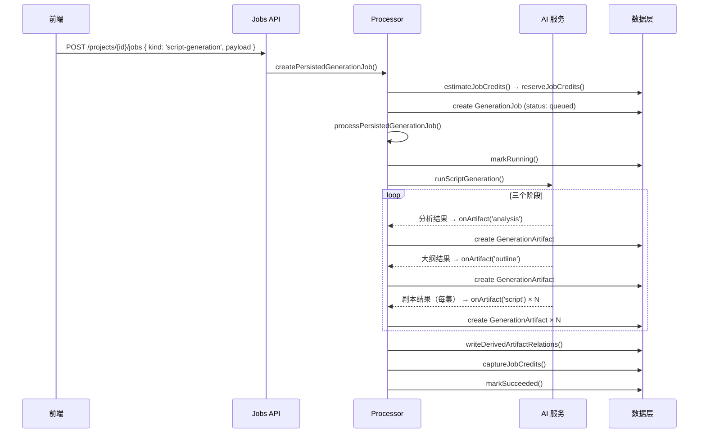
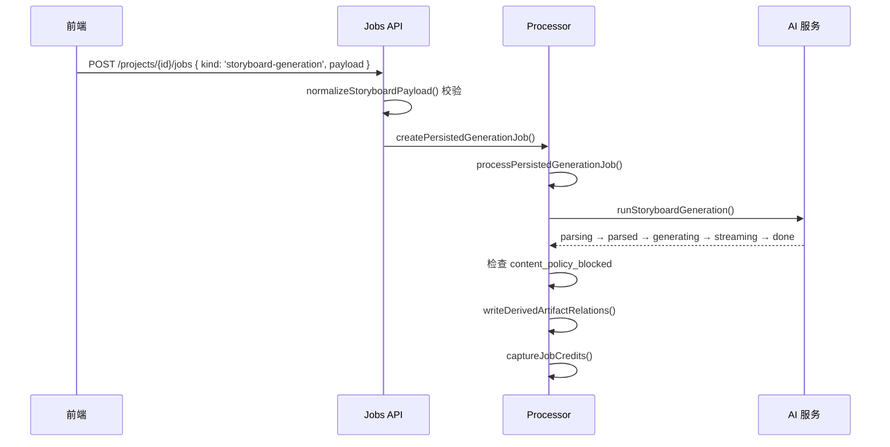
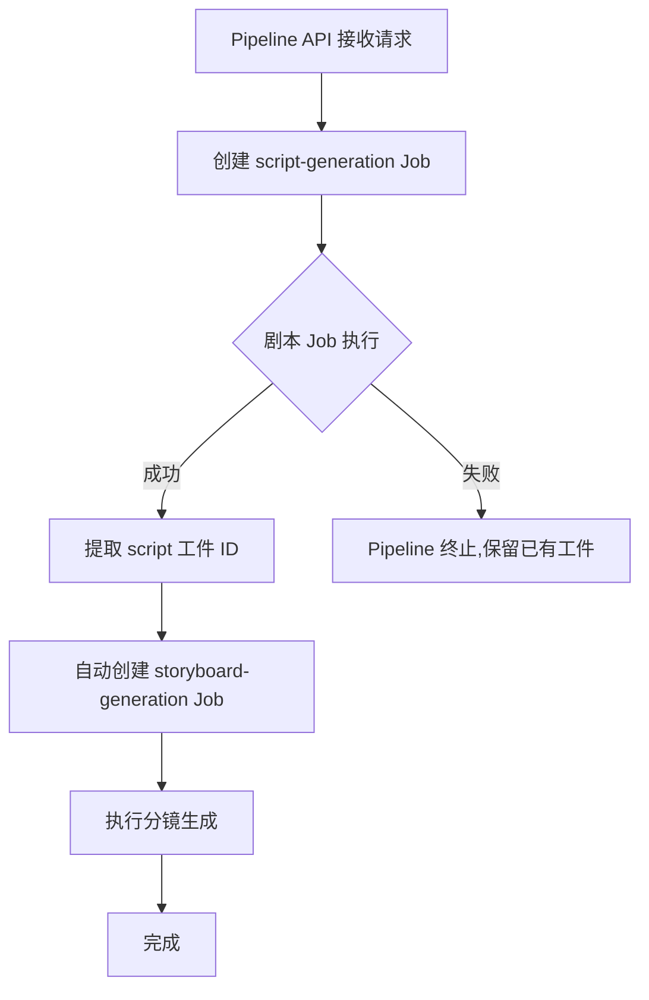
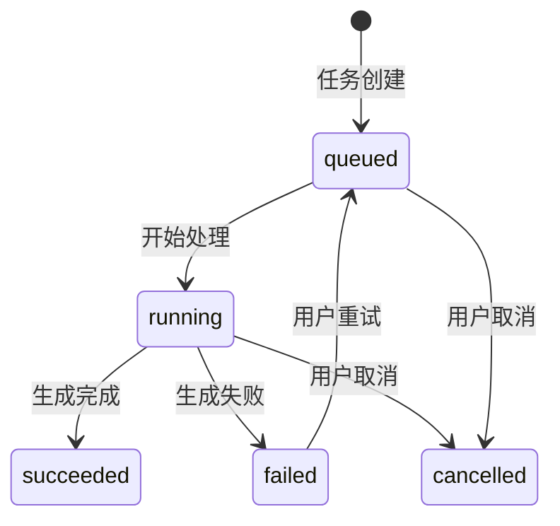
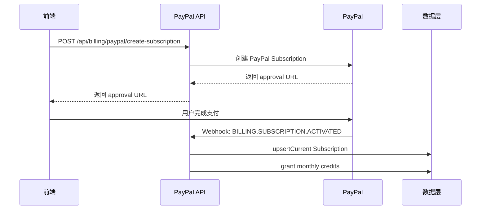
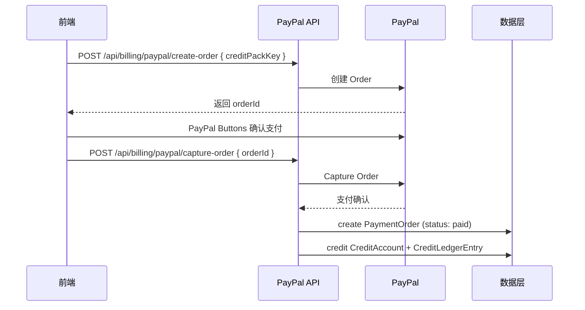

# NovelScript SaaS 功能规格说明文档（FSD）

> 文档类型：功能规格说明（Functional Specification Document）  
> 关联 PRD：`docs/comprehensive-prd.md` v3.0  
> 更新日期：2026-03-24  
> 版本：v1.0

---

## 1. 概述

本文档从 **工程实现** 角度，逐模块描述 NovelScript SaaS 平台各功能的交互逻辑、状态流转、数据流向和错误处理方式。PRD 定义「做什么」，FSD 定义「怎么做」。

---

## 2. 模块一：用户认证与初始化

### 2.1 注册流程

| 步骤 | 前端行为 | 后端逻辑 | 数据产物 |
|------|---------|---------|---------|
| 1 | 用户填写邮箱 + 密码，提交 | 验证邮箱唯一性 | — |
| 2 | — | 创建 `User`（`status: 'active'`） | `User` |
| 3 | — | 自动创建 `Organization`（`slug` 由邮箱前缀推导） | `Organization` |
| 4 | — | 自动创建 `Workspace`（`slug: 'default'`） | `Workspace` |
| 5 | — | 创建 `CreditAccount`（`availableCredits: 0`） | `CreditAccount` |
| 6 | — | 创建 `Subscription`（`planKey: 'free'`, `provider: 'internal'`）并写入 Free 计划权益 | `Subscription` |
| 7 | — | 通过 `CreditLedgerEntry`（`kind: 'subscription_grant'`）发放 30 credits | `CreditLedgerEntry` |
| 8 | 跳转项目中心 `/{locale}/projects` | — | — |

> **关键约束**：用户全程不感知 Organization / Workspace 的存在，前端 UI 不展示这些概念。

### 2.2 登录流程

1. 前端提交邮箱 + 密码 → 后端校验 `passwordHash`
2. 校验通过 → 生成 session → 更新 `User.lastLoginAt`
3. 前端获取 `viewer`（`user` + `organization` + `workspace` + `subscription` + `creditAccount`）

### 2.3 viewer 解析

每个需要认证的 API 调用通过 `requireViewerResponse()` 获取当前已认证用户的完整上下文：

```typescript
interface Viewer {
  user: User;
  organization: Organization;
  workspace: Workspace;
  subscription: Subscription | null;
  creditAccount: CreditAccount | null;
}
```

---

## 3. 模块二：项目中心

### 3.1 项目创建

**前端输入**：标题、题材（genre）、简介（description）。

**后端逻辑**：
1. 接收 `name`, `description`, `genre`
2. 调用 `createProject()` → 生成唯一 `slug`（基于 name，冲突时追加数字后缀）
3. 写入 `Project`（`status: 'draft'`, `organizationId`, `workspaceId`）
4. 返回完整 `Project` 对象

**权益检查**：验证当前用户项目数 < `entitlements.maxProjects`（Free: 2, Creator: 15, Pro: null=无限）。

### 3.2 项目列表

**API**：`GET /api/projects`  
**查询逻辑**：`listByOrganizationId(viewer.organization.id)`  
**排序**：按 `updatedAt` 降序  
**返回字段**：`project` + 概要信息（最后更新时间、运行中任务数、已有工件类型摘要）

### 3.3 项目工作台（Project Bundle）

**API**：`GET /api/projects/[projectId]`  
**核心数据**：调用 `getProjectBundle(projectId)` 返回：

```typescript
{
  project: Project;
  sourceDocuments: SourceDocument[];
  jobs: GenerationJob[];           // 按 createdAt 降序
  artifacts: GenerationArtifact[]; // 按 createdAt 降序
  artifactRelations: ArtifactRelation[];
  insights: ProjectArtifactInsights;
}
```

**前端 Tab 结构**：

| Tab | 数据来源 | 操作 |
|-----|---------|------|
| 原文 | `sourceDocuments` 中 `kind === 'novel'` | 粘贴/编辑/保存 |
| 分析 | `artifacts` 中 `kind === 'analysis'` | 浏览/下载 |
| 大纲 | `artifacts` 中 `kind === 'outline'` | 浏览/下载 |
| 剧本 | `artifacts` 中 `kind === 'script'` | 浏览/按集查看/下载/继续生成分镜 |
| 分镜 | `artifacts` 中 `kind === 'storyboard'` | 浏览/下载/查看来源剧本 |
| 导出 | 所有 `artifacts` | 统一筛选/下载 |
| 任务 | `jobs` | 状态/进度/重试 |

### 3.4 项目操作

| 操作 | API | 逻辑 |
|------|-----|------|
| 归档 | `PATCH /api/projects/[projectId]` | `status → 'archived'`, `archivedAt = now()` |
| 删除 | `DELETE /api/projects/[projectId]` | 软删除/归档处理 |

---

## 4. 模块三：原文输入与素材管理

### 4.1 保存原文

**API**：`POST /api/projects/[projectId]/source`

**前端输入**：
- `title`：原文标题
- `textContent`：粘贴的小说原文

**后端逻辑**（`saveProjectSource()`）：
1. 校验 `projectId` 存在且属于当前用户
2. 计算中文字数 `countChineseWords(textContent)`
3. 如已有 `sourceDocumentId` → 更新现有 `SourceDocument`
4. 如无 → 创建新 `SourceDocument`（`kind: 'novel'`, `mimeType: 'text/plain'`）并更新 `Project.sourceDocumentId`

**P1 扩展**：文件上传（txt/md/docx），后端提取文本内容后，写入同一 `SourceDocument` 模型。

### 4.2 原文回看

在项目工作台「原文」Tab 中展示最新 `SourceDocument.textContent`，用户可随时修改并重新保存。

---

## 5. 模块四：剧本引擎

### 5.1 生成配置

用户在原文 Tab 配置以下参数：

```typescript
interface ScriptGenerationConfig {
  genre: 'urban' | 'xianxia' | 'fantasy';
  episodeCount: number;        // 1–20
  episodeDuration: '1:00-1:30' | '1:30-2:00' | '2:00-3:00';
  style: 'dramatic' | 'comedic' | 'suspense';
  includeDirectorNotes: boolean;
}
```

### 5.2 生成流程



### 5.3 工件关系写入（ArtifactRelation）

剧本生成完成后，自动写入以下关系：

| upstream | downstream | relationType |
|----------|-----------|-------------|
| analysis | outline | `derived_from` |
| outline | script (每集) | `derived_from` |

### 5.4 Credits 计费

```
estimateJobCredits('script-generation', { episodeCount }) 
  = 30 + max(1, episodeCount) × 15
```

生命周期：`reserved → captured`（成功）或 `reserved → released`（失败/取消）

### 5.5 错误处理

| 场景 | 处理 |
|------|------|
| LLM 调用失败 | `failAndRelease()` → 释放 credits → `markFailed()` |
| 任务被取消 | 检测到 `JOB_CANCELLED` → 释放 credits → 中止 |
| 额度不足 | `reserveJobCredits()` 抛出 `INSUFFICIENT_CREDITS` → 返回 402 |

---

## 6. 模块五：分镜引擎

### 6.1 输入方式

支持两种输入，优先级 `scriptArtifactIds` > `scriptText`：

| 输入方式 | 场景 | 数据来源 |
|---------|------|---------|
| `scriptArtifactIds` | 从剧本 Tab「继续生成分镜」 | 选中的剧本工件 ID 列表 |
| `scriptText` | 手动粘贴剧本文本 | 用户输入 |

### 6.2 输入校验（normalizeStoryboardPayload）

1. `scriptArtifactIds` 去重、去空
2. 逐个验证工件存在、属于同一 project、`kind === 'script'`
3. 如都为空且无 `scriptText` → 抛 `STORYBOARD_SOURCE_REQUIRED`

### 6.3 生成流程



### 6.4 工件关系写入

| upstream | downstream | relationType |
|----------|-----------|-------------|
| script (每个来源剧本) | storyboard | `derived_from` |

来源 scriptArtifactIds 从 `payload.scriptArtifactIds` 和 `artifact.metadata.sourceScriptArtifactIds` 合并去重。

### 6.5 Credits 计费

```
estimateJobCredits('storyboard-generation', { episodeCount })
  = max(8, episodeCount × 8)
```

### 6.6 安全模式

`safeMode: true` 时，LLM 生成的分镜内容中，暴力/色情/敏感内容被替换或标注。若触发 `content_policy_blocked`，整个任务标记为失败。

---

## 7. 模块六：Pipeline 一键链路

### 7.1 触发方式

**API**：`POST /api/projects/[projectId]/pipelines`

```typescript
{
  mode: 'novel-to-storyboard',
  payload: {
    text: string;
    genre: 'urban' | 'xianxia' | 'fantasy';
    config: ScriptGenerationConfig;
    analysis?: AnalysisResult;        // 可选,已有分析结果可复用
    storyboardConfig?: {
      visualStyle?: string;
      colorTone?: string;
      genreLabel?: string;
      safeMode?: boolean;
    };
  }
}
```

### 7.2 执行流程



**实现细节**（`processor.ts` → `maybeRunNovelToStoryboardPipeline()`）：
1. 剧本 Job 的 `metadata` 中标记 `pipelineMode: 'novel-to-storyboard'`
2. 剧本 Job 成功后 → 检测 pipelineMode → 提取所有 `kind === 'script'` 的工件 ID
3. 自动调用 `createPersistedGenerationJob()` 创建分镜 Job
4. 串行执行 `processPersistedGenerationJob()`

### 7.3 计费说明

Pipeline 分别按剧本 Job 和分镜 Job **独立计费**。两个 Job 各自经历 `reserve → capture/release` 生命周期。

### 7.4 中途停下

用户可在剧本阶段取消 Pipeline（通过取消剧本 Job），此时分镜 Job 不会被创建。已生成的剧本工件保留，用户可手动在剧本 Tab 调整后再单独生成分镜。

---

## 8. 模块七：资产浏览与下载

### 8.1 资产浏览

在项目工作台「导出」Tab 中，统一展示项目下所有 `GenerationArtifact`。

**筛选维度**：
- 按类型：`analysis` / `outline` / `script` / `storyboard`
- 按时间：`createdAt` 降序

**依赖关系展示**：
- 通过 `artifactRelations` 查询每个工件的上游（来源）和下游（派生）
- 无 relation 的历史工件降级展示「无依赖数据（历史产物）」

### 8.2 下载格式

| 优先级 | 格式 | 实现 |
|--------|------|------|
| P0 | TXT | `GenerationArtifact.content` 直接输出 |
| P0 | Markdown | 根据 `kind` 格式化标题 + 内容 |
| P0 | JSON | `GenerationArtifact` 完整结构化输出 |
| P1 | DOCX | 服务端生成 .docx 文件 |
| P1 | CSV | 仅分镜：结构化镜头数据导出 |

**导出 API**：`GET /api/projects/[projectId]/exports?artifactIds=xxx&format=markdown`

---

## 9. 模块八：任务中心

### 9.1 任务状态机



### 9.2 任务列表展示

| 字段 | 来源 |
|------|------|
| 任务类型 | `GenerationJob.kind` |
| 当前状态 | `GenerationJob.status` |
| 触发时间 | `GenerationJob.createdAt` |
| 当前进度 | `GenerationJob.progress` (0-100) |
| 当前阶段 | `GenerationJob.currentStep` |
| 消耗积分 | `GenerationJob.settledCredits` |
| 错误信息 | `GenerationJob.errorMessage`（仅 failed） |

### 9.3 阶段化进度

不同生成类型的阶段：

**剧本生成**：`预处理 → 分析 → 大纲 → 剧本(集1) → ... → 剧本(集N) → 完成`

**分镜生成**：`解析 → 角色/场景识别 → 生成 → 流式输出 → 完成`

**Pipeline 模式**：两个子任务各自展示独立进度。

---

## 10. 模块九：支付与套餐

### 10.1 PayPal 订阅流程



### 10.2 PayPal 点数包购买流程



### 10.3 套餐体系

| 计划 | PlanKey | USD/mo | 月 Credits | 最大项目数 | 最大并发 |
|------|---------|--------|-----------|-----------|---------|
| 免费版 | `free` | $0 | 30 | 2 | 1 |
| 创作者版 | `creator` | $9.90 | 200 | 15 | 2 |
| 专业版 | `pro` | $29.00 | 600 | 无限 | 3 |

所有计划均：`maxMembers: 1`, `maxWorkspaces: 1`, `canUseTeamCollaboration: false`。

### 10.4 点数包

| CreditPackKey | USD | Credits |
|---------------|-----|---------|
| `credits-50` | $4.90 | 50 |
| `credits-200` | $14.90 | 200 |
| `credits-500` | $29.90 | 500 |

### 10.5 Webhook 签名验证

PayPal Webhook 路由接收事件后：
1. 验证 webhook 签名（`PAYPAL_WEBHOOK_ID`）
2. 根据事件类型分发处理（`BILLING.SUBSCRIPTION.ACTIVATED` / `PAYMENT.CAPTURE.COMPLETED`）
3. 幂等处理：通过 `providerOrderId` / `providerSubscriptionId` 防止重复交付

---

## 11. 模块十：入口与导航

### 11.1 首页路由逻辑

```typescript
// src/app/page.tsx
if (已登录) → redirect('/{locale}/projects')
else → 渲染 Landing Page
```

### 11.2 导航结构

**已登录**：`Logo | Projects | Pricing | Credits: XX | Avatar ▾`

**未登录**：`Logo | Pricing | Login | Sign Up`

### 11.3 旧路径兼容

| 旧路径 | 行为 |
|--------|------|
| `/console` | redirect → `/{locale}/projects` |
| `/storyboard` | 已登录 → `/{locale}/projects`；未登录 → Landing |
| `/` | 已登录 → redirect；未登录 → Landing |

---

## 12. 全局约束与规则

### 12.1 多租户隐藏

- 后端保留 `Organization` / `Workspace` 模型
- 前端 UI **任何位置** 不出现「工作区」「组织」字样
- 注册自动创建，全程透明

### 12.2 国际化

- 支持 `zh-CN` / `en-US`
- 所有用户可见文本通过 i18n 管理
- 套餐名称、描述由 `catalog.ts` 中 `Record<SupportedLocale, string>` 提供

### 12.3 并发控制

通过 `entitlements.maxConcurrentJobs` 控制同时运行的 Job 数量。创建新 Job 前需检查 `listActiveByWorkspaceId()` 返回的运行中任务数。

### 12.4 错误码规范

| 错误码 | HTTP Status | 场景 |
|--------|------------|------|
| `PROJECT_NOT_FOUND` | 404 | 项目不存在/无权限 |
| `INSUFFICIENT_CREDITS` | 402 | 额度不足 |
| `STORYBOARD_SOURCE_REQUIRED` | 400 | 分镜无输入来源 |
| `SCRIPT_ARTIFACT_NOT_FOUND` | 400 | 指定的剧本工件不存在 |
| `SCRIPT_ARTIFACT_NOT_IN_PROJECT` | 400 | 剧本工件不在当前项目 |
| `SCRIPT_ARTIFACT_KIND_INVALID` | 400 | 工件类型不是 script |
| `JOB_CREATE_FAILED` | 400 | Job 创建失败 |
| `PIPELINE_CREATE_FAILED` | 400 | Pipeline 创建失败 |

---

## 13. 术语对照

| FSD 术语 | 代码对应 | 说明 |
|---------|---------|------|
| viewer | `requireViewerResponse()` 返回值 | 当前认证用户的完整上下文 |
| project bundle | `getProjectBundle()` 返回值 | 项目维度的所有数据聚合 |
| job | `GenerationJob` | 一次生成任务实例 |
| artifact | `GenerationArtifact` | 生成的资产（分析/大纲/剧本/分镜） |
| artifact relation | `ArtifactRelation` | 工件间的派生关系 |
| pipeline | `createNovelToStoryboardPipeline()` | 小说→分镜的串行编排 |
| credit lifecycle | reserve → capture/release | 积分的预留→扣减/退还周期 |
